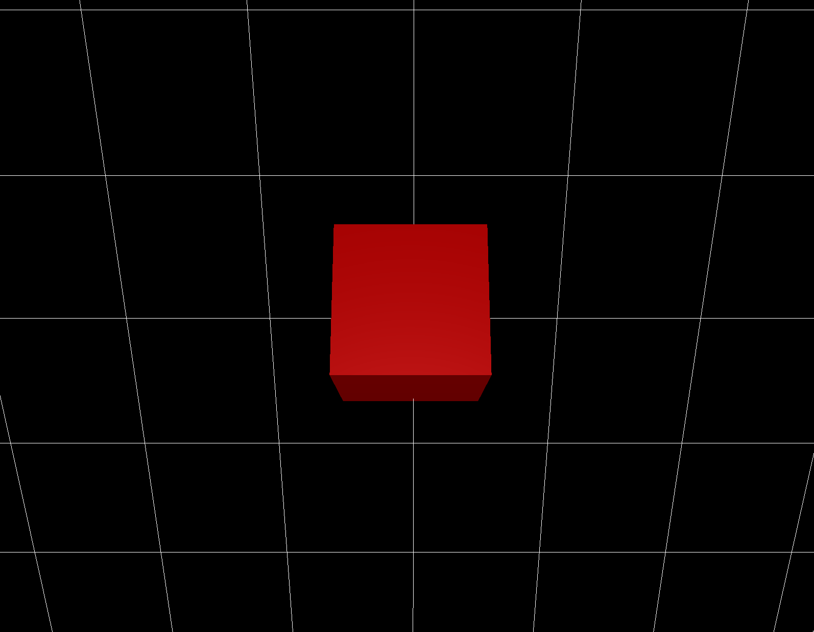

# ReeControl

A 3D rigid-body simulator written in Rust for 8-thruster input as derived from `thruster_layout.yaml`.

The motiviation for this project is to develop reactive and resilient control schemes with application to autonomous submarines.
Some ideas/goals:
- Machine Learning Control (Genetic Algorithms, Neural Nets)
- Data Driven System Characterization
- Local cost optimization
- Online learning of PID gains
- Quantum algorithms for linear regression

